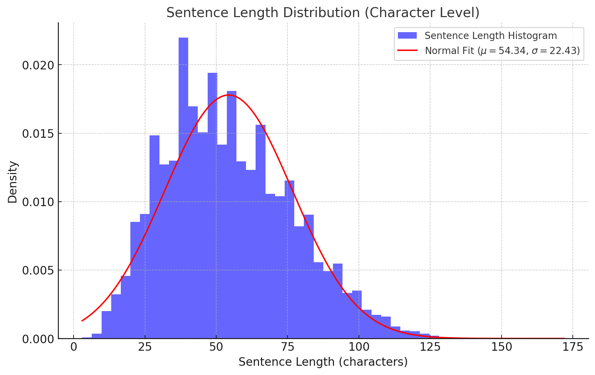

# Attack Plan

To evaluate the robustness of our German-to-English speech translation model we design adversarial attacks based on selected attributes from the CommonVoice and Europarl dataset. These attributes include demographic (gender and age), linguistic (accent) factors, and sentence length. Additionaly we want to attack it with out of domain data and background noice.

---

**Rationale for Attribute Selection**:

1. **Accent (Austria, Germany, Switzerland)**:  
   - The model’s performance is likely influenced by variations in accent, as speech translation systems often struggle with subtle pronunciation differences.
   - These accents represent regional diversity within German-speaking populations and are sufficiently represented in our dataset. The abundance of data allows for comprehensive testing without the risk of under-sampling bias.

2. **Gender (Male and Female)**:  
   - Gender-based differences in pitch, speaking style, and vocal characteristics can impact speech recognition and translation accuracy.
   - Including gender in adversarial testing ensures the model is robust across diverse speaker profiles.

3. **Age (Teens, Twenties, Thirties, Fifties, and beyond)**:  
   - Age influences vocal tone and articulation, introducing variability that could affect model performance.
   - The dataset contains diverse age groups, allowing us to test whether the model performs consistently across speakers with age-related variations in speech.

4. **Sentence Length (Character Level)**:  
   - Variations in sentence length can challenge the model’s ability to handle short and long sentences effectively.
   - By analyzing the distribution of sentence lengths, we can identify any biases or weaknesses related to sentence complexity or brevity.
   - The chart below illustrates the sentence length distribution in the dataset, showing how the majority of sentences cluster around specific lengths, with a fitted normal distribution curve for better visualization.

5. **Out of Domain (Europarl)**
   - To assess the model’s ability to generalize and handle domain shifts effectively.
	- Europarl’s formal, structured text contrasts with conversational and casual styles typical of CommonVoice data.

6. **Background Noice (Qualitative Assessment)**
   - As we discovered during inference our model tends to catch up on background noice.
   - We do not have a dataset to check this but want to do a qualititve analysis for this.

#### Male Distribution:
| age       |   germany |   austria |   switzerland |
|:----------|----------:|----------:|--------------:|
| fifties   |     28667 |       746 |          2898 |
| fourties  |     56807 |      1067 |           144 |
| seventies |       318 |        25 |            16 |
| sixties   |      5507 |         9 |            36 |
| teens     |     10413 |       257 |           154 |
| thirties  |     51671 |      2705 |           396 |
| twenties  |     71188 |      2023 |           684 |

#### Female Distribution:
| age       |   germany |   austria |   switzerland |
|:----------|----------:|----------:|--------------:|
| eighties  |         4 |         0 |             0 |
| fifties   |      4000 |        82 |           229 |
| fourties  |      2385 |        18 |             0 |
| seventies |        71 |        21 |             0 |
| sixties   |      1351 |         0 |            36 |
| teens     |       147 |        22 |             4 |
| thirties  |      2610 |       352 |             0 |
| twenties  |      5962 |        30 |             5 |

#### Sentence Length Distribution:
